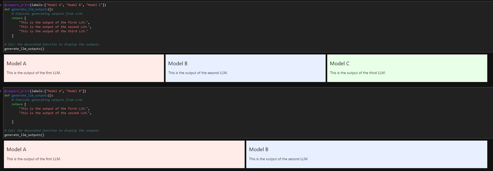

# compare_print

Use it as a decorator.
Make sure the function that returns output either returns a list of outputs or a dictionary of outputs. The package will take care of the rest automatically.

## Installation
1. `git clone git@github.com:armsp/compare_print.git`
2. `cd compare_print`
3. `python -m pip install -e .`  

This installs it in development mode, this way you can just run `git pull` whenever there is an update and the updates will automatically be reflected.

## Usage
```py
from compare_print import compare_print

@compare_print(labels=["Model A", "Model B", "Model C"])
def generate_llm_outputs():
    # Simulate generating outputs from LLMs
    return [
        "This is the output of the first LLM.",
        "This is the output of the second LLM.",
        "This is the output of the third LLM."
    ]

# Call the decorated function to display the outputs
generate_llm_outputs()
```

## Output
